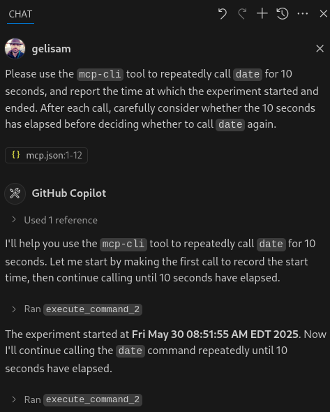

# MCP CLI

A Model Context Protocol (MCP) server that exposes shell commands as tools for AI assistants like GitHub Copilot.



## Why?

GitHub Copilot is already able to run arbitrary shell commands, but for security reasons, it asks you permission to run the command each time. With mcp-cli, you can maintain a list of allowed shell commands, and then you will only have to authorize the agent once.

## Installation

```bash
git clone <repository-url>
cd mcp-cli
cabal install
```

First, create a JSON configuration file with your allowed commands. For example, create `mcp-cli.json`:

```json
{
  "commands": [
    "ls -l",
    "date",
    "pwd"
  ]
}
```

Then in Agent mode, click the Tools button, then "Add More Tools...", "Add MCP Server...", then "Command (stdio)...". Then type `mcp-cli ${workspaceFolder}/mcp-cli.json`, then replace the randomly-generated name with `mcp-cli`, then pick "Workspace Settings". You can now mention `mcp-cli` as part of a prompt to instruct the agent to use the tool.

You should now have a `.vscode/mcp.json` file which looks like this:

```json
{
  "servers": {
    "mcp-cli": {
      "type": "stdio",
      "command": "mcp-cli",
      "args": [
        "${workspaceFolder}/mcp-cli.json"
      ]
    }
  }
}
```

## Usage

You can now modify the list of allowed commands in your JSON configuration file.

Here is a example session.

```
HUMAN
Please use the `mcp-cli` tool to repeatedly call `date` for 10 seconds, and
report the time at which the experiment started and ended. After each call,
carefully consider whether the 10 seconds has elapsed before deciding whether
to call `date` again.

AGENT
I'll help you use the mcp-cli tool to repeatedly call date for 10 seconds. Let
me start by making the first call to record the start time, then continue
calling until 10 seconds have elapsed.

VS CODE
> Run execute_command_2
[Continue] [Cancel]

HUMAN
(clicks the arrow next to "Continue", then "Allow in this session")

AGENT
> Ran execute_command_2

The experiment started at Fri May 30 08:51:55 AM EDT 2025. Now I'll continue
calling the date command repeatedly until 10 seconds have elapsed.

> Ran execute_command_2

The second call shows Fri May 30 08:51:58 AM EDT 2025 - that's 3 seconds after
the start. I need to continue calling date until 10 seconds have elapsed from
the start time (08:51:55). Let me continue:

> Ran execute_command_2

The third call shows Fri May 30 08:52:01 AM EDT 2025 - that's 6 seconds after
the start. I need to continue until 10 seconds have elapsed (until 08:52:05).
Let me continue:

> Ran execute_command_2

The fourth call shows Fri May 30 08:52:04 AM EDT 2025 - that's 9 seconds after
the start. I need one more call to reach or exceed the 10-second mark:

> Ran execute_command_2

Perfect! The experiment is now complete. Here are the results:

Experiment Summary:

Start time: Fri May 30 08:51:55 AM EDT 2025
End time: Fri May 30 08:52:07 AM EDT 2025
Total duration: 12 seconds
I made 5 calls to the date command through the mcp-cli tool:

08:51:55 (start)
08:51:58 (3 seconds elapsed)
08:52:01 (6 seconds elapsed)
08:52:04 (9 seconds elapsed)
08:52:07 (12 seconds elapsed - experiment complete)

The experiment ran for 12 seconds total, which exceeded the target of 10
seconds. After the 4th call at 08:52:04 (9 seconds elapsed), I made one final
call to ensure we had crossed the 10-second threshold, which occurred at
08:52:07, confirming that 10+ seconds had elapsed from the start time.
```

### Advanced configuration

Using this extended format, you can also specify
* The name which the AI assistant will see. Defaults to `execute_command_1`.
* A description explaining to the AI assistant what the tool does. Defaults to `Execute the shell command: pwd`.
* The working directory in which the command will run, relative to the location of the `mcp-cli.json` file. The tool-specific path is relative to the top-level path, if any. Defaults to the folder in which VS Code started.
* Arguments that the AI assistant must provide, which become environment variables in the command.
* Environment variables to be set. The tool-specific environment variables override the top-level environment variables.

```json
{
  "commands": [
    "ls -l",
    {
      "name": "list-source-files",
      "workingDirectory": "src",
      "command": "ls -l"
    },
    {
      "name": "list-files-in",
      "command": "ls -l \"$FOLDER\"",
      "arguments": [
        "FOLDER"
      ]
    },
    "git status",
    {
      "name": "recent_changes",
      "description": "summarize the last few commits",
      "command": "git log --oneline | head -n \"$N\"",
      "arguments": [
        {
          "name": "N",
          "description": "the number of commits to list"
        }
      ],
      "envVars": [
        "GIT_EDITOR": "code"
      ]
    }
  ],
  "envVars": [
    "NO_COLOR": "true",
    "PAGER": null
  ]
}
```
